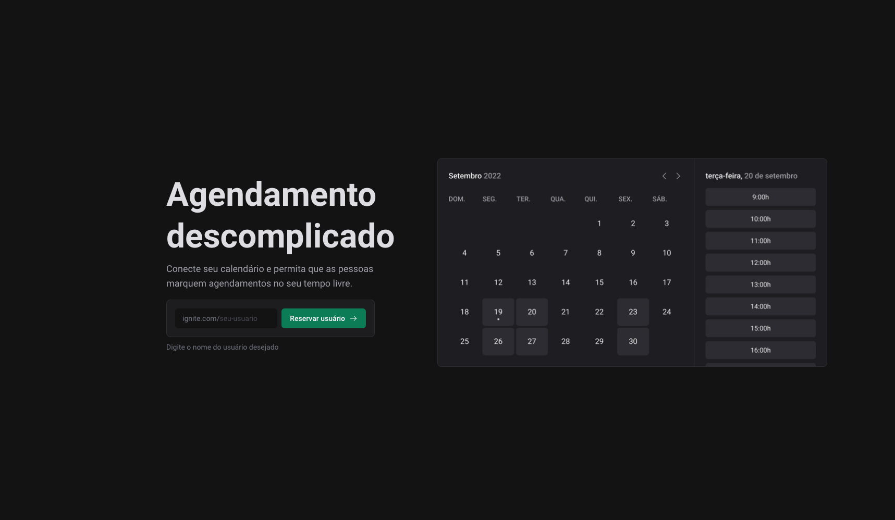

# Ignite Call

Uma aplicação de agendamento inteligente, onde os usuários podem configurar seus horários disponíveis, conectar com o Google Calendar e permitir que outras pessoas agendem compromissos automaticamente de acordo com a disponibilidade.

## 🚀 Demonstração

**Live:** https://ignite-call-gabriel.vercel.app  
**Repositório:** [github.com/gabriel-valino/ignite-call](https://github.com/gabriel-valino/ignite-call)



## 🧪 Tecnologias Utilizadas

- Next.js 13 (App Router)
- React
- TypeScript
- Tailwind CSS
- Prisma ORM
- NextAuth (OAuth com Google)
- React Hook Form
- Zod
- Day.js
- Google Calendar API
- Vercel

## 📦 Instalação

```bash
git clone https://github.com/gabriel-valino/ignite-call.git
cd ignite-call
npm install
npm run dev
```

## ✨ Funcionalidades

- Conexão com conta Google via OAuth
- Sincronização com Google Calendar
- Configuração de disponibilidade personalizada
- Agendamento de compromissos com envio automático de eventos
- Validação de formulários com Zod
- Proteção de rotas autenticadas com NextAuth
- Design responsivo e moderno

## 📚 Desafios Técnicos

A integração com o Google Calendar exigiu configuração de permissões OAuth, autenticação segura com tokens e mapeamento entre os dados da agenda e os slots disponíveis no sistema. Trabalhar com o Prisma também foi um desafio no que diz respeito à modelagem e criação de relacionamentos entre usuários, horários e agendamentos.

## 🧠 O que aprendi

- Integração OAuth segura com o Google
- Manipulação de calendários e datas com Day.js
- Uso de autenticação com NextAuth no App Router
- Modelagem de banco de dados com Prisma
- Criação de uma experiência fluida para agendamentos em tempo real
